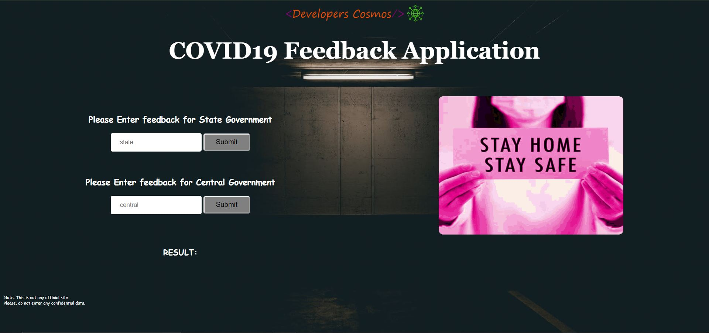
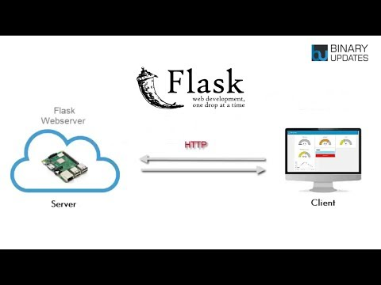
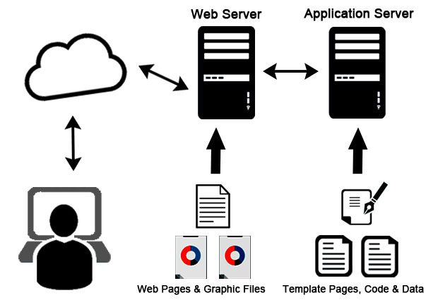
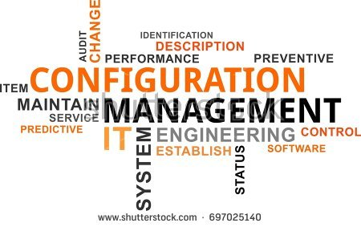
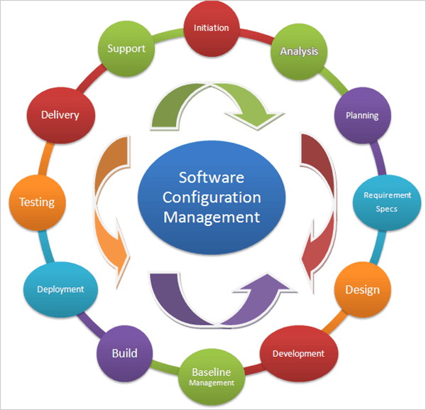
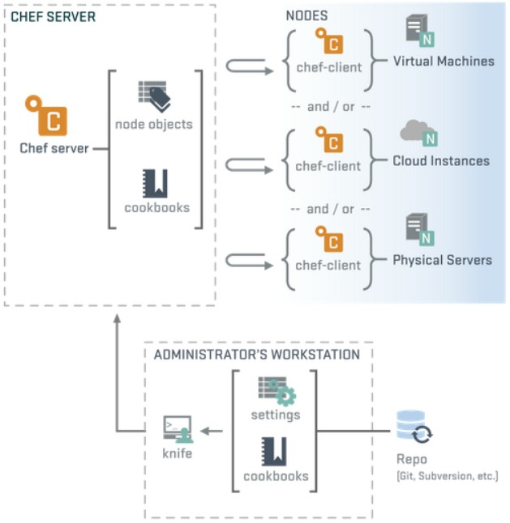
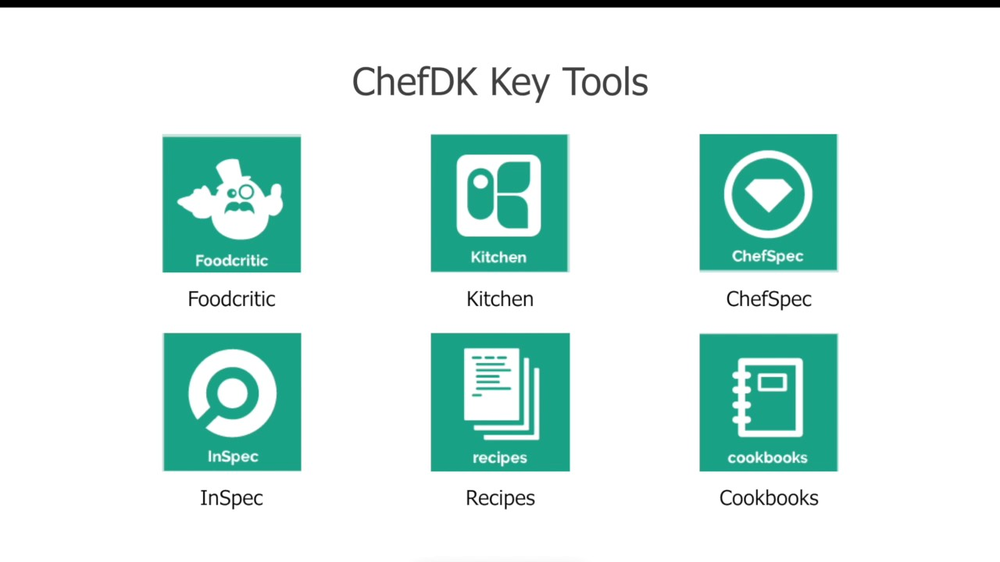
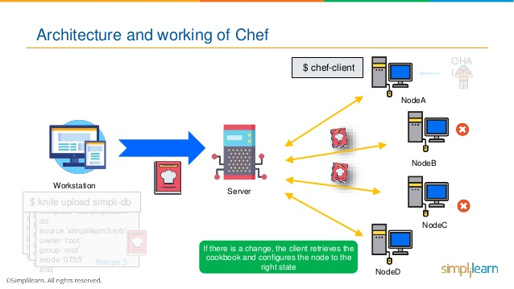
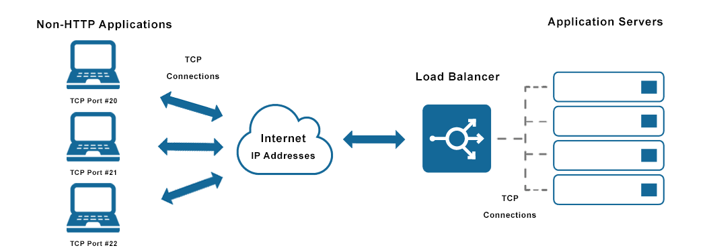

# COVID19 Feedback Application
- ## Project Aims
   A small application is developed using sentiment analysis to understand how satisfied people are with the measures State and Central government is taking in the wake of COVID-19. The user is required to input how he/she feels about the State Government initiatives and click on 'Submit'. Repeat the same process with the Central Government. In each of the two cases, you see that your sentiments are being interpreted based on the words you chose to share. Typically, you'll see what percentage you are satisfied/dissatisfied with the current situation. You can check our application at [COVID19 Feedback Application](http://104.154.117.66/)

    

    <b>Note:</b> The website is solely built for the purpose of explaining different platforms and technologies used in the process of building and deploying an application. Please do not assume it to be anything official tied up with the government bodies. The data you enter will be purely confidential and used for improvising the existing model.

- ## Background
    We used Flask, VADER Sentiment Analysis, Google Compute Engine, Chef - a Configuration Management tool & Load Balancer to accomplish our tasks. All the technologies used in this application will be briefly discussed here.
    
    <i>Are you excited? So why wait Let's Get Started!!</i>

    

- ## Web Servers and Services
    A web server can either be a software application or hardware which takes care of the back end activities when a task is initiated. There are different types of web servers available which you can use depending on the application. Assume you've written an algorithm that takes an image as input and tells what are the objects present in the image. If you want your peers to use the program, you make a web page. Now whoever opens the web page and inputs an image, the algorithm runs in the back end - in the webserver which can be made to run in your command window or a simple editor in your system. The user merely sees the list of objects detected in the image but nothing else. Here, the real work is happening in the background on the web server that you've created for your clients.

    

    For our application, we have made use of <b>Flask</b> which is a micro web framework written in Python. It is classified as a micro web framework because it does not require particular tools or libraries. Flask is easy to use and can be utilized when making simple application servers. But a problem arises when you shut your system down which halts your server. People trying to use your website at that moment won't be able to, because the website is unable to connect to the server. You have to restart the whole server once again to grant access. To overcome this, we run the server as something called <b>Service</b>. 
    
    

    Service helps one run a certain program in the background by automatically allowing it to start and stop as and when the system turns on and off. This makes the manual tedious task as easy as the server restarts automatically once the system reboots.

- ## Machine Learning Model for Sentiment Analysis:
    In this project, we've used VADER Sentiment Analyzer to detect the percentage of satisfaction with the initiatives being taken by the State and Central Government. VADER (Valence Aware Dictionary and sEntiment Reasoner) is a rule-based sentiment analysis tool that is specifically attuned to sentiments expressed in social media and works well on texts from different domains.

    

    Now that the model is ready, let's get into the intricacies and problems one might face while developing and deploying it.

- ## The Conventional Way!!

    A successful project pivots on numerous factors, especially in case of a software development project, there are so many programs linked to so many other programs. Now consider you've joined as a software developer in a new company and are assigned a project. To get started smoothly, you've to <b>manually</b> download a number of software tools, packages, etc. required by the project to get your machine/laptop to the desired state. Now imagining the worst, what if you configure everything and are ready to begin and suddenly your system crashes? All that hard work for naught! But so was the case when we did not know what <b>Configuration Management</b> meant.

    

    Without Configuration Management an Organization may face various problems. Here's an interesting explanation from a blog explaining what happens without Configuration Management.

    Consider a situation, A developer implementing a feature will commonly install a few bits of software and deploy code. If things are sloppy, this developer probably makes the team and manager aware of the intention to come back later to clean it all up—that it’s simply a demonstration and will be rewritten soon.

    
    
    But then the deadline starts pressing, and the task of going back through and rewriting the installation steps as a script gets pushed lower and lower in priority. Before we know it, several years have passed, and a new developer gets put on the project. That developer is now left to pick up the pieces, trying to understand what happened. It’s quite likely they aren’t even going to touch the configuration of the server. Who knows what it would do!

    The above situation is precisely what configuration management helps you avoid. We don’t want to be left in the dark as a result of developers setting up software without proper documentation/traceability. Rather, we want to know the answers to questions like

    What services are we running?<br>
    What state are those services in?<br>
    How did they get to their current state?<br>
    What was the purpose for the changes?<br>
    <b>Configuration Management</b> can tell us these answers.

- ## With Configuration Management

    In simple terms, CM is the process of maintaining consistency over a period of time. Here consistency can refer to anything right from design to performance. 
    
    

    Configuration management predominantly provides the following features:

    1. Provides automatic management of configurations at each state of set up meaning, it ensures that there is a backup recovery available in case the system crashes. 
    2. Keeps the whole system stable by updating the system time to time according to the requirements. 
    3. Capable of *Provisioning* which is the act of adding more resources (usually servers) to our running application. CM ensures that we know what a good state of our service is. That way, when we want to increase the number of servers that we run, it’s simply a case of clicking a button or running a script. 
    4. Software downtime which refers to the time when a system is unavailable is also surmounted as CM verifies the performance of a system by regularly testing it.
    5. In CM, we slide from traditional scripting to idempotence scripting which merely means that a task is not initiated in the system if it has already been done before, saving time, memory, and steering clear of dependency issues.

    So SCM(Software Configuration Management) is really amazing, understood! But how do we do it and utilize all the benefits it is providing us? It is not so difficult you see, we again have a lot of tools to implement SCM few of which are Ansible, Puppet, Juju, SaltStack, and Chef. In our application, Chef is being used, so let's get going and learn the story of <b>Chef,</b> our knight in shining armor! 

- ## Chef
    Chef is a company and the name of a configuration management tool written in Ruby and Erlang.Honestly, the name Chef is very relevant to what it does. A chef normally writes the recipe, takes all the ingredients, and starts preparing the dish. Even in the case of our Software Configuration Management tool - Chef, the same is being done but with different terms and outcomes. It consists of three vital fragments namely Workstation, Chef Server, and Nodes.
    
    

    There's also something known as a chef-client which acts as an agent that runs locally on every node that is under management by Chef. When a chef-client is run, it will perform all of the steps that are required to bring the node into the expected state. Now that the chef-clients are set up at the nodes, let's get into understanding what the three important fragments do.

- ## Chef - Workstation
    This is the warehouse, base station, backstage, preparation room, or whatever you might like to call it. The complete code of our application is developed and tested here followed by the configuration using the chef command tools(Chef Development kit). All the requests received by the chef-server are handled (granted/declined/modified) by the workstation.
    
    

    - What we develop at the workstation are known as <b>recipes</b>. Surprised already? There's more to come! So recipes are a way of managing 'system components,' (also known as resources) by installing packages, running programs and, creating, editing, or deleting files when the need arises. 
    - After all the downloading and development is done we cannot just let it sprawl in the system in an unorganized manner, so the whole bunch of codes and files are arranged in the desired order and are stored in <b>cookbooks</b>. We can simply say that the cookbooks are containers/storage houses for our recipes. 
    - Once the recipes are ready within a cookbook, testing is done using the a tool, <b>Kitchen</b> to see if everything is in place. Once satisfied, we upload the cookbooks containing resources and recipes, and the supported components to the Chef Server using another tool <b>Knife.</b>

    

    - Chef InSpec - Chef's open source security & compliance automation framework. Foodcritic is a helpful lint tool you can use to check your Chef cookbooks for common problems.

        To know more about the supported components, visit [Chef infra.](https://docs.chef.io/chef_overview/)

- ## Chef - Server
    The Chef Server acts as a hub of information. Cookbooks and policy settings are uploaded to the Chef Server by users from workstations. Remember when we spoke about web servers and hosts? Yes, as the name suggests, the chef-server does a similar job. Also, Chef provides us with a hosted server of its own which is readily available to use. Chef servers precisely bridge the gap between the workstation and all the nodes. We receive cookbooks, recipes, policies, and other useful components from the workstation, and chef-server will distribute our cookbooks to any managed nodes connected to it.

    

    As mentioned earlier, knife is used to upload cookbooks from workstation to the chef servers, the same knife also acts as primary means of communication while getting information(like the ipaddress of node , hostname..) from nodes to workstation via chef servers acting as a pull server for our nodes.

- ## Nodes
    Node is any machine that is being managed by Chef, it can be a physical, virtual, or cloud network devices. As mentioned above, the node uses chef-client service to pull & apply cookbooks from chef-server, this process is known as convergence. When a node converges, it synchronizes with the server and whenever it is triggered, it pulls updates to any policy. For this to happen, we first need to spin up the nodes (create virtual machines). We have used Google Compute Engine from the Google Cloud Platform (GCP) to create the nodes in the cloud. The nodes can also be any public computer and not just a cloud.

    Now we need to configure each and every node connected to the server i.e, we need to bring all those to the desired state. To establish successful communication between the chef server and nodes, bootstrapping has to be done. The node we are bootstrapping may not have chef-client installed, also it may not have details of where our client-server is located or the credentials to securely talk to our server. To add that credentials and all those requirements we simply bootstrap that node to install all those components using a single command.

    ```bash
    $knife bootstrap FQDN -x user -P password --sudo -N nodename -r "recipe[cookbookname]"
    ```
    Here FQDN stands for Fully Qualified Domain Name which is replaced by our External IP address of the node. Once we run the above code, all the nodes will be run with our services installed on their machines. One-click at the IP address will pull up the COVID-19 Feedback Application for you!

- ## Chef - Summary

    

    1. A computer with ChefDk( Chef Development Kit) installed on it is called the <b>chef workstation.</b>
    2. Each organization has one or more workstations, a single server, every node that will be configured, and maintained by the chef-client.
    3. Cookbooks & recipes tell the chef-client how each node in our organization will be configured.

- ## Load Balancer

    In our daily lives, we use a number of services like, let's take an example of Google. The whole world uses Google and quite obviously it has its own server which is always running in the background. Now try to imagine how many people try to search for something on Google at a given time of the day. One server trying to bear the load of so many users will just wither away and die. To prevent this from happening, we make use of multiple nodes wherein each node has an upper limit for the number of users it can serve at a given time. Also, every node has a unique IP address using which, we access the services. Now while creating a new node, we've to upload all the necessary cookbooks and recipes to it, but we don't have to worry about it as we have Chef on our side which gladly does the job for us.

    

    
    Now let us consider we have two nodes with different IP addresses redirecting us to the same page. We enter the first IP address and find that the node is overloaded, so we enter the second IP address and luckily are in the desired page. But what if this address was overloaded too? How many IP addresses like that can you remember? What if we have some process by which a machine listens to your requests round the clock and redirects you to the node which is free (available to use)? 

    We're in absolute luck! To save us from this miserable predicament, here comes the <b>'Load Balancer.'</b>

    

    *Load balancing* refers to the process of distributing a set of tasks over a set of resources (computing units), with the aim of making their overall processing more efficient. All we need to do is remember the IP address of the load balancer which remembers the IP address of all the nodes for us. We enter the IP address of the load balancer and it does the math for us analyzing whichever node is free and escorting us to our destination!

    The IP address of our load balancer is http://104.154.117.66/ and you'll be able to see the IP address of the node which is serving you at the moment on the bottom right corner of your screen. When you refresh the page you can see the hostname( feedbacknode1 or feedbacknode2) and internal ipaddress of the node which is currently serving you.

    

    This is how a haproxy Load balancer works, click [here.](https://www.digitalocean.com/community/tutorials/an-introduction-to-haproxy-and-load-balancing-concepts)

    

- ## References

    * [Web Server](https://en.wikipedia.org/wiki/Web_server)
    * [Windows Services](https://en.wikipedia.org/wiki/Windows_service)
    * [Configuration Management](https://en.wikipedia.org/wiki/Configuration_management)
    * [Chef](https://docs.chef.io/)
    * [Load Balancer](https://en.wikipedia.org/wiki/Load_balancing_(computing))

- ## Thank you :D
    We have used many online resources while creating the application and we would like to thank them. As we are in the learning stage, we would like to know your feedback and suggestions as well.<br> Please contact us at developerscosmos6@gmail.com
    
    <b>Contributors:</b>    
    [TharunKumar](https://github.com/tharun435) |  [Saadia-Hassan](https://github.com/Saadia-Hassan) | [RitheeshBaradwaj](https://github.com/RitheeshBaradwaj)