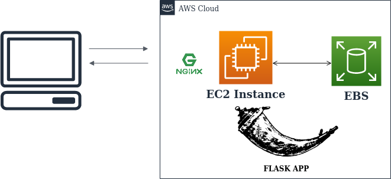

<h1> Deploying Machine Learning Models as a service using AWS EC2 </h1>

> Benefits of Deploying as a service on EC2
*  We can Create Custom storage and store the Data (which can’t be done while we deploy our model as Web Application using PAAS.

* Performance (we can autoscale the instances whenever required)
* Security (we can control who can use service by adding security groups and VPC)

Check out our article for complete information on

<a href='https://medium.com/towards-artificial-intelligence/deploying-machine-learning-models-as-a-service-using-aws-ec2-97a6434194ca?source=friends_link&sk=deb841276fe0985ab594f357fac1eee2'> Deploying Machine Learning Models as a service using AWS EC2 </a>

