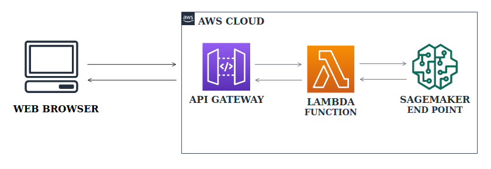

<h1> Deploying Machine Learning Models as API using AWS </h1>

> As a machine learning practitioner, I used to build models. But just building models is never sufficient for real-time products. ML models need to be integrated with web or mobile applications. One of the best ways to solve this problem is by deploying the model as API and inferencing the results whenever required.

<h2>Architecture </h2>
 

<b>Workflow &nbsp;: &nbsp;</b>The client sends a request to the API. API trigger is added to the Lambda function which results in invoking the SageMaker endpoint and returning predictions back to the client through API.

> Check out our article for detailed explanation.

<a href=
'https://medium.com/towards-artificial-intelligence/deploying-machine-learning-models-as-api-using-aws-a25d05518084?source=friends_link&sk=51edbb3e4021c8ad7573dc28c4098b16'> Deploying Machine Learning Models as API using AWS </a>

<h3> Thank You </h3>
