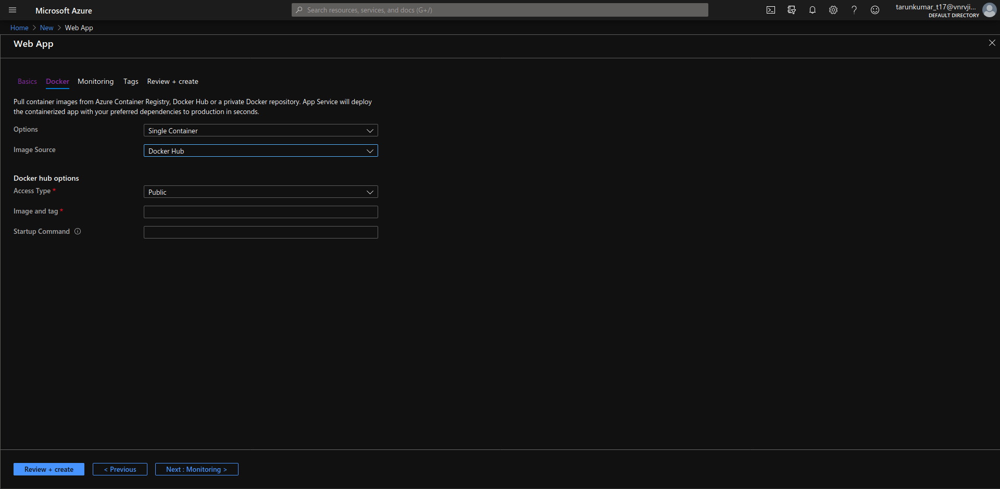
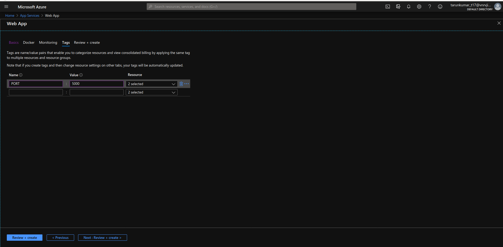
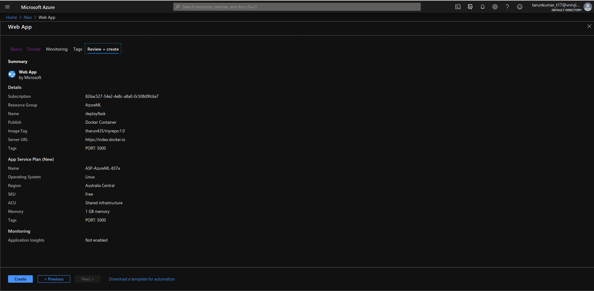

<h1> Deployment Of  Flask App on Azure  
 </h1>

>Azure Web Apps provides a platform to build an App in Azure without having to deploy, configure and maintain your own Azure VM's. You can build Web App using the ASP.NET, PHP, Node. js and Python. They also integrate common development environments which could be Visual Studio and GitHub.

<h4> To Review the Implemented Deployment Please visit 
<a href='https://deploymodel.azurewebsites.net/'>  &nbsp; &nbsp; https://deploymodel.azurewebsites.net/</a> <h4>

<h2>STEPS TO FOLLOW</h2>

<h3>1. Create a Directory Containing FlaskApp, Index.html and requirements.txt &nbsp; . </h3>
<p> <b>NOTE &nbsp; : </b>  &nbsp; To generate requirements .txt , go to path in command prompt or Terminal and type <b><i>pipreqs</i></b>.

<h3> 2. Create a Dockerfile.</h3>

```
FROM python:3.7-slim

WORKDIR /app

ADD . /app

RUN pip install --trusted-host pypi.python.org -r requirements.txt

EXPOSE 5000

ENV NAME OpentoAll

CMD ["python","app.py"]

```

<h3> 3. Build Your Docker Image.</h3>

<p>docker buid -t  imagename:tag

```
docker buid -t azuremlr:latest . 
```
<p> For More details visit <a href='https://runnable.com/docker/python/dockerize-your-flask-application'> Dockerizing Flask App </a>

<h3> 4 . Tag your Docker Image and push to docker hub.</h3>

```
docker tag azuremlr tharun435/myrepo:1.0
```
<p><b>NOTE &nbsp; :  </b>  &nbsp;&nbsp; Please Create your account in Docker Hub if you don't have a one</p>

<h3> 5 .&nbsp; Push your Image to Your Repositories in Docker Hub .</h3>

```
docker push tharun435/myrepo:1.0
```
<h3> 6. &nbsp; Go to your Azure account , Web services , click add. </h3>


* Create a new Resource group and select Docker Container to Publish . Click Next:Docker.


<h3> 7.&nbsp; Select Image Source as Docker Hub and give your Image name you pushed to the docker hub in step 5 &nbsp; .</h3>



<h3> 8. Click next Monitoring and go to tags, give port and value .</h3>


<h3> 9. &nbsp; Click Review and create .</h3>



<h3> Succesfully the Web app is created and a link will be generated like this. <a href='https://deploymodel.azurewebsites.net/'> https://deploymodel.azurewebsites.net/
</a> </h3>

<hr />

<h3>References </h3>

- <a href='https://runnable.com/docker/python/dockerize-your-flask-application'> Dokerizing Flask APP</a>
- <a href='https://docs.microsoft.com/en-us/azure/app-service/'> Azure Documentation </a>

- <a href='https://youtu.be/E1u3xzzL08k?list=PLlH6o4fAIji6FEsjFeo7gRgiwhPUkJ4ap'> Creating  Web  Apps on Azure </a>

<h2> Thank You :D </h2>
<p><i>I have used many online resources while creating the application and I would like to thank them</i> . &nbsp; Hope you found it insightful.If you have any queries you can mail me at : <b> kumartharun435@gmail.com </b>. I would love to hear feedback from you to improvise it and make it better! </p>


