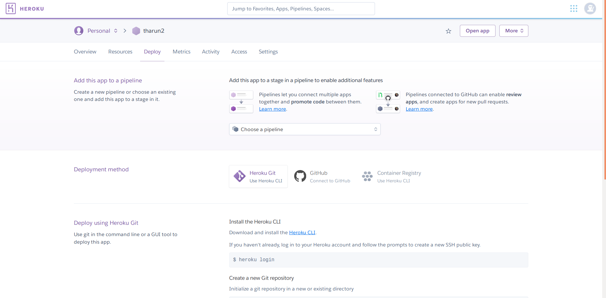
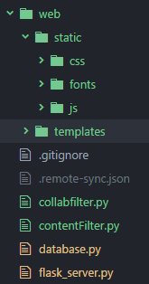
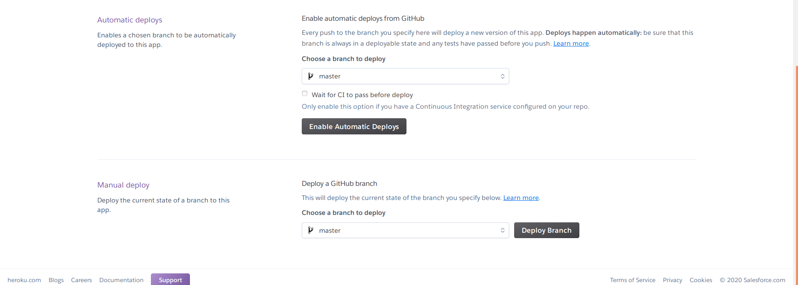

<h1> Deployment Of  Flask App on Heroku
 </h1>

 >Heroku is a platform as a service (PaaS) that enables developers to build, run, and operate applications entirely in the cloud. It is generally considered to be easy-to-use. But it’s most beneficial to businesses in specific situations. Heroku has a free service model for small projects, but tiered service packages exist for cases where more complex business needs must be addressed.

> In this Repo I implemented  Prediction of salary using Linear Regression and deployed to Heroku.
 <h4>To Review the Implemented Deployment Please visit  
<a href=https://tharun3.herokuapp.com> https://tharun3.herokuapp.com</a> <h4>

<h2>STEPS TO FOLLOW</h2>
<h3>1. Create a Directory Containing FlaskApp, Index.html and requirements.txt </h3>
<p> <b>NOTE &nbsp; : </b>  &nbsp; To generate requirements .txt , go to path in command prompt or Terminal and type <b><i>pipreqs</i></b>

>Add These in your  &nbsp; <i>requirements.txt  </i>   &nbsp; as these ensure proper deployment in Heroku cloud.

```
gunicorn==19.9.0
itsdangerous==1.1.0
Jinja2==2.10.1
MarkupSafe==1.1.1
Werkzeug==0.15.5
```

<h3> 2. Create a Procfile</h3>

>A Procfile is a list of process types in an app.

```
web: gunicorn app:app
```
>The first app represents the name of the python file that runs your application or the name of the module it is in. The second app represents your app name.

<p> <b> In My repo My python  name is app.py and application name is app.</b></p>

<p><b> Upload These Files in Git Repo </b></p>

```
model.pkl
app.py 
requirements.txt 
Procfile 
templates 
```


<h3> 3. Open Heroku clock create new and select app</h3>
<p> Give a name to your app and create</p>
<h3> 4. Connect to github and select Your Repo.</h3>


> * Make Sure Port is set to 5000 or any valid port value.
> * If you have Images in your html page , they should be in static folder.

<p> Please Refer the Structure </p>


<h3>4 . Click Deploy Branch </h3>


<p> A Link Will be Generated after sucessful Deployment like this <a href='https://tharun3.herokuapp.com ' > https://tharun3.herokuapp.com</a> </p>

<hr />

<h3>References </h3>

- <a href='https://flask.palletsprojects.com/en/1.1.x/tutorial/factory/'> Flask Documentation </a>

- <a href='https://www.geeksforgeeks.org/deploy-machine-learning-model-using-flask/?ref=rp'> Deploying Machine Learning models as flask app</a>

- <a href='https://hack4impact.github.io/flask-base/deploy'> Deploying Flask Application to Heroku </a>

<h2> Thank You :D </h2>
<p>Hope you found it insightful. I would love to hear feedback from you to improvise it and make it better! </p>


