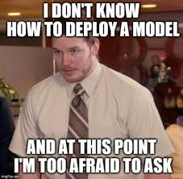
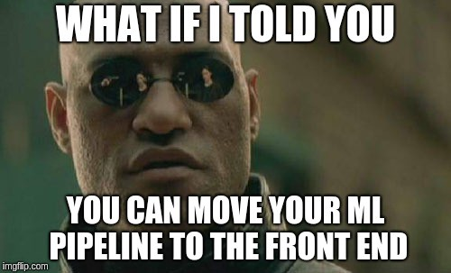
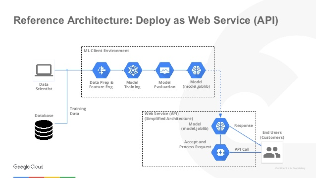
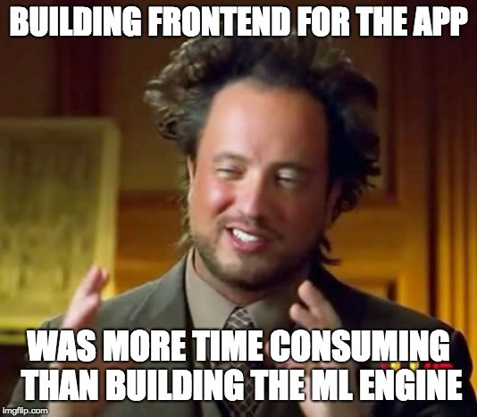

<h1> Deployment Of Machine Learning Models </h1>

 Imagine You built  an Optimized Model and got an accuracy of x%. You stop the Process , Continue to next Model. But in Real Case Scenarios, Bringing Models into Production and Sharing Business insights is Important. 

>Don''t Know How to Deploy?

 </img>

> Don't worry . This Repo Contains Deployment of Machine Learning Models on Various cloud services like Azure, Heroku, AWS,GCP etc.

<h2> Let's get Started</h2>

 <b>Data scientists build Machine learning models in jupyter lab, google colab and the likes, Machine learning engineers take the built model into production.

Deployment of an ML-model simply means the integration of the model into an existing production environment which can take in an input and return an output that can be used in making practical business decisions.
</b>

<h2>General  Architecture </h2>

 </img>

<h2> Deployment  Types </h2>

 </img>

<h3> 1. Deploying Models in PAAS </h2>

> Machine Learning Models can be Deployed on Paas like Heroku, AWS ElasticBeanStalk, Azure Web apps etc.

Platform-as-a-service provides a framework for developers to create their own applications. Essential, PaaS gives developers an online platform to create and manage software without worrying about maintaining everything else. Users manage the applications and data they create and store while the provider handles all the rest. PaaS offerings are built on virtualizations and often come with services to aid in testing and deploying applications.

<h2> Pass Architectures</h2>
<h2 > 1 . GCP  Architecture  </img> </h2>

<h2> 2 . Azure Architecture  </img> </h2></h2>

<h3> 2. Deploying in IAAS </h2>

>Machine Learning Models can be Deployed on Iaas like AWS EC2, GCP Virtual Machines etc.

 Infrastructure-as-a-service offers the most management responsibilities for users. IaaS is a fully self-service model where the provider delivers infrastructure resources via virtualization technologies. IaaS comprises scalable computing, storage, and security capabilities accessed on an API or dashboard. Users manage the data infrastructure themselves without having to worry about physical installations.

With IaaS, users have the most control over the resources provided to them. IaaS offers the systems needed to deploy applications and software without the need to maintain physical hardware. This means, though, that users need to ensure they handle the runtime and OS securely in order to avoid distributing harmful software. IaaS eliminates the physical aspect of owning and operating data centers while still requiring the same safety and security protocols.

<h2> Conclusion </h2>

 </img>

<h2> Thank You :D </h2>

<i>I have used many online resources while creating the application and I would like to thank them .   </i>Hope you found it insightful.If you have any queries you can mail me at : kumartharun435@gmail.com . I would love to hear feedback from you to improvise it and make it better!  

